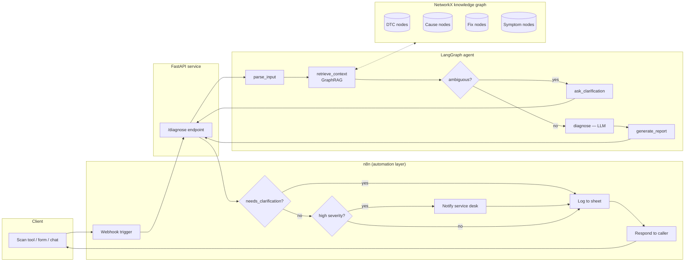

# GarageMind

[](https://github.com/sivagangapb7/garagemind/actions/workflows/tests.yml)

Agentic automotive diagnostic assistant. You describe a symptom or give it an OBD-II code (`P0171`, "rough idle and check engine light"), and a [LangGraph](https://github.com/langchain-ai/langgraph) agent walks a hand-built knowledge graph of ~30 real SAE diagnostic trouble codes — GraphRAG-style retrieval instead of a vector store — to ground its answer in structured cause/fix data rather than free-associating. [n8n](https://n8n.io) sits on top as the automation layer: it's what a shop would actually wire up to route a diagnosis to a technician, log it, or page someone when severity is high.

```
"P0171, rough idle" ─▶ FastAPI /diagnose ─▶ LangGraph agent ─▶ GraphRAG over NetworkX KG ─▶ structured report
                             ▲
                             │
                    n8n webhook + routing (severity branch, notify, log)
```

## Why this exists

Most "AI mechanic" demos either hardcode a lookup table or let an LLM freely guess at car problems, which means it can confidently invent a cause that isn't real. GarageMind separates those two jobs: retrieval decides *what's true* (it can only surface causes and fixes that actually exist in the graph), and the LLM's only job is to *phrase* what retrieval found. That also means the whole pipeline runs and is testable with zero API cost — the offline mode isn't a fallback bolted on afterward, it's how the test suite and CI stay free.

## Architecture



**The LangGraph state machine** (`src/agent/`):

1. `parse_input` — pulls DTC codes out with regex + a light LLM pass (catches unusual formats), splits free text into symptom clauses.
2. `retrieve_context` — the GraphRAG step. Walks the NetworkX graph from whatever was extracted, ranks candidate causes by edge-weight (likelihood) × corroboration, and **narrows ambiguous symptom-only queries using multi-clue agreement**: if two independent symptom phrases both point at the same code, that code wins over one only weakly implied by a single generic symptom (see `_generic_symptom_threshold`, an IDF-style filter so "check engine light" — present on almost every code — can't alone drag in the whole graph).
3. **Conditional edge** — if retrieval came up empty, or a symptom-only query is still too broad to resolve confidently, route to `ask_clarification` instead of guessing.
4. `diagnose` — the only node that calls an LLM for open-ended text, and it's explicitly instructed to reason only over the retrieved evidence block, not prior knowledge.
5. `generate_report` — assembles the structured JSON report (matched codes, severity, ranked causes, fix sequence, confidence, related codes, and how many graph nodes it's grounded in).

**The knowledge graph** (`src/graph/`) is built from `data/dtc_knowledge_base.json`, a curated set of 30 real SAE J2012 (P0xxx) codes spanning fuel/air metering, ignition, emissions, and transmission systems, each with symptoms, components, likelihood-weighted causes, fixes, and cross-references to related codes. Building it produces **354 nodes / 738 edges**.

## Live demo

`docker compose up` (or `python -m src.api.main`) serves a browser UI at `/` alongside the API — type a code or symptom, get the diagnosis back rendered, no terminal needed. To get a public URL: push this repo to GitHub, then deploy it with one click via [Render Blueprints](https://dashboard.render.com/blueprints) (reads `render.yaml` automatically — free tier, ~2 minutes, needs a card on file but costs $0 at this scale).

## Try it in 30 seconds (no API key needed)

```bash
git clone <this-repo>
cd garagemind
pip install -r requirements.txt
python examples/demo.py "P0171 and rough idle"
```

That's a real run of the full LangGraph agent and GraphRAG retrieval — the only thing offline mode skips is the LLM call for the final phrasing (see [Offline mode](#offline-mode-vs-a-real-llm) below). Try the ambiguity handling too:

```bash
python examples/demo.py "check engine light is on"          # too vague -> asks for the actual code
python examples/demo.py "shudder at cruising speed and poor fuel economy"  # multi-symptom -> narrows to P0740
python examples/demo.py --interactive
```

## Running the full stack (API + n8n)

```bash
cp .env.example .env        # optionally add an LLM_PROVIDER key, see below
docker compose up --build
```

- API: `http://localhost:8000/docs` (FastAPI's interactive Swagger UI)
- n8n: `http://localhost:5678` — import `n8n/garagemind_workflow.json` (Workflows → Import from File), then activate it. It exposes `POST /webhook/garagemind-diagnose`, calls the API, branches on severity (email/Slack-style notify for high-severity codes), logs every call, and responds to the caller.

Or run the API alone: `uvicorn src.api.main:app --reload` and `curl -X POST localhost:8000/diagnose -d '{"report": "P0300"}' -H 'content-type: application/json'`.

## Offline mode vs. a real LLM

`src/llm/provider.py` picks a backend by priority: explicit arg → `LLM_PROVIDER` env var → whichever `*_API_KEY` is set (OpenAI → Anthropic → Groq) → an offline deterministic `MockChatModel`. The offline model isn't a stub that returns "TODO" — it runs the same regex code-extraction and templated diagnosis-summary logic a rules-based first pass would, so the demo, the CLI, and the test suite all produce real, useful output with zero signup. Drop in a free [Groq](https://console.groq.com/keys) key for LLM-generated summaries instead of the template.

## Testing

```bash
pip install -r requirements.txt
pytest -q
```

15 tests, all offline: graph-construction invariants, GraphRAG retrieval correctness (including a regression test for the generic-symptom over-matching bug this caught during development), and a 15-case hand-labeled evaluation set (`tests/eval_set.json`) scored for accuracy the way you'd score any retrieval system — currently **100%** (15/15). GitHub Actions (`.github/workflows/tests.yml`) runs the same suite on every push — no secrets needed, since it's all offline.

## Project layout

```
data/dtc_knowledge_base.json   curated OBD-II DTC dataset (source of truth)
src/graph/                     NetworkX graph construction + GraphRAG retrieval
src/agent/                     LangGraph state, nodes, compiled graph
src/llm/                       multi-provider LLM abstraction + offline mock
src/api/                       FastAPI service (/diagnose, /health) + static/index.html browser UI
n8n/garagemind_workflow.json   importable n8n automation workflow
examples/demo.py               zero-setup CLI demo
tests/                         unit tests + labeled eval set
docker-compose.yml             API + n8n, wired together
render.yaml                    one-click deploy config for a public demo URL
.github/workflows/tests.yml    CI: runs the full test suite on every push
```

## Honest limitations

The DTC dataset is curated (30 codes), not the full SAE list — it's sized to demonstrate the architecture end-to-end, not to be a production diagnostic tool. Symptom matching is lexical (substring + word-overlap), not embedding-based, by design — it keeps retrieval free and fully explainable, at the cost of missing paraphrases an embedding model would catch. This is not a substitute for an actual mechanic; treat its output as a first-pass triage aid.
